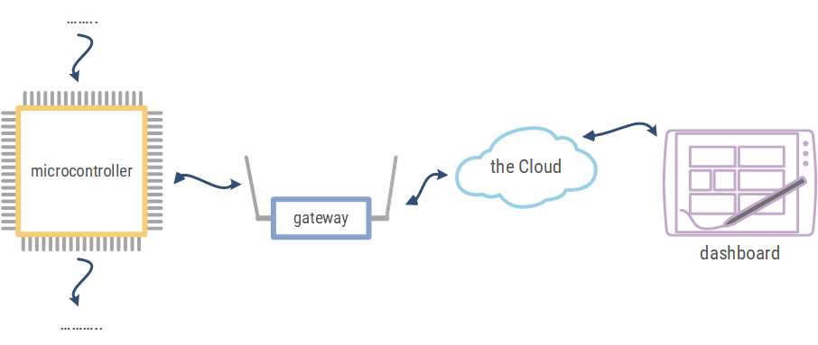

# Blokschema

Een mogelijk blokschema van een IOT-applicatie via cloud-communicatie kan er als volgt uitzien.

De microcontroller in het toestel (Thing) kan informatie afkomstig van sensoren op het toestel doorsturen naar de cloud. De informatie wordt eventueel verwerkt en weergegeven op het verschillende vormen van toestellen zoals computers, tablets en smartphones. Dit kan zowel in een app zijn als in de browser.

Het is eveneens mogelijk vanop een computer, tablet, smartphone … actuatoren verbonden met de microcontroller aan te sturen. Zoals bijvoorbeeld bij een domotica-systeem.  

# Opdrachten

Vul het blokschema van onderstaande slimme toestellen aan en beantwoord de bijhorende vragen.

Voorbeeld slimme thermostaat
* Welk type sensor zal gebruikt worden om de temperatuur te detecteren?
* Wat zal de actuator zijn in het blokschema?
* Plaats de sensor en de actuator in het blokschema.
* Welk toestel bij je thuis doet dienst als gateway?
* Welk toestel bij je thuis doet dienst als dashboard?

Voorbeeld detectie en weergave parkeerplaatsen
* Welk type sensor zal gebruikt worden om het aantal parkeerplaatsen te detecteren?
* Hoe zal de beheerder van de parking zien hoeveel parkeersplaatsen er vrij zijn?
* Waar wordt de info bewaard hoelang een wagen op de parking staat?

