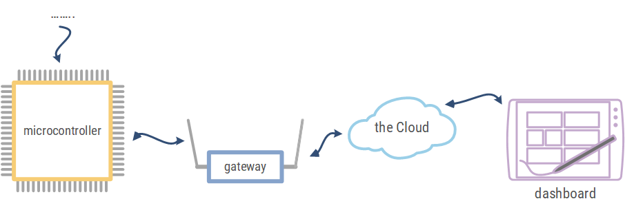

# Blokschema

Een mogelijk blokschema van een IOT-applicatie via cloud-communicatie kan er als volgt uitzien.

De controller op het toestel (Thing) kan informatie afkomstig van sensoren op het toestel doorsturen naar de cloud. De informatie wordt eventueel verwerkt en weergegeven op verschillende vormen van toestellen. 
Het is eveneens mogelijk vanop een computer, tablet, smartphone … actuatoren verbonden met de controller aan te sturen. Zoals bijvoorbeeld bij een domotica-systeem.  

# Opdrachten

Stel een mogelijk blokschema op van voorgaande slimme toestellen.

Voorbeeld slimme thermostaat

Voorbeeld detectie en weergave parkeerplaatsen

