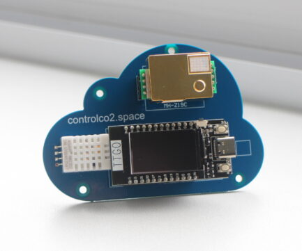

# Voorbeelden

## Slimme thermostaat 

[Website Nest](https://store.google.com/be/product/nest_learning_thermostat_3rd_gen)

[Voorstelling door Coolbue](https://www.youtube.com/watch?v=jfHO05LzPn8)

## Detectie beschikbare parkeerplaatsen

[Uitleg industrial-iot.nl](https://industrial-iot.nl/slimme-parkeerplaatsen-in-de-slimme-stad/)

## Energieverbruik en productie monitoren

[Vlaamse producent Smappee](https://www.smappee.com/be_en/homepage)

[Vlaamse producent 2-wire](https://www.2-wire.net/)

## Slimme deelfietsen en steps

[Website uber bike](https://www.uber.com/be/nl/ride/uber-bike/)

[Voorstelling Jump by Uber](https://www.youtube.com/watch?v=lYBvx-kgr3A)

[Artikel rond deelsteps](https://gocar.be/nl/autonieuws/mobiliteit/elektrische-deelsteps-alles-wat-je-erover-moet-weten)

## Slimme vuilbakken

[Uitleg industrial-iot.nl](https://industrial-iot.nl/prullenbakken-verbonden-met-internet/)

## Gebruikstijd, productie … machines registeren en analyseren

[Vlaamse leverancier IOT oplossingen Savaco](https://www.savaco.com/nl/events/detail/iot-in-de-praktijk-webinarreeks)

## CO2 sensoren

[Website en montagehandleiding voor het onderwijs](https://controlco2.space/)

## Toepassingen in haven van Antwerpen

 

[YouTube link naar de toepassingen in haven van Antwerpen](https://www.youtube.com/watch?v=09KxrJQde_Q)